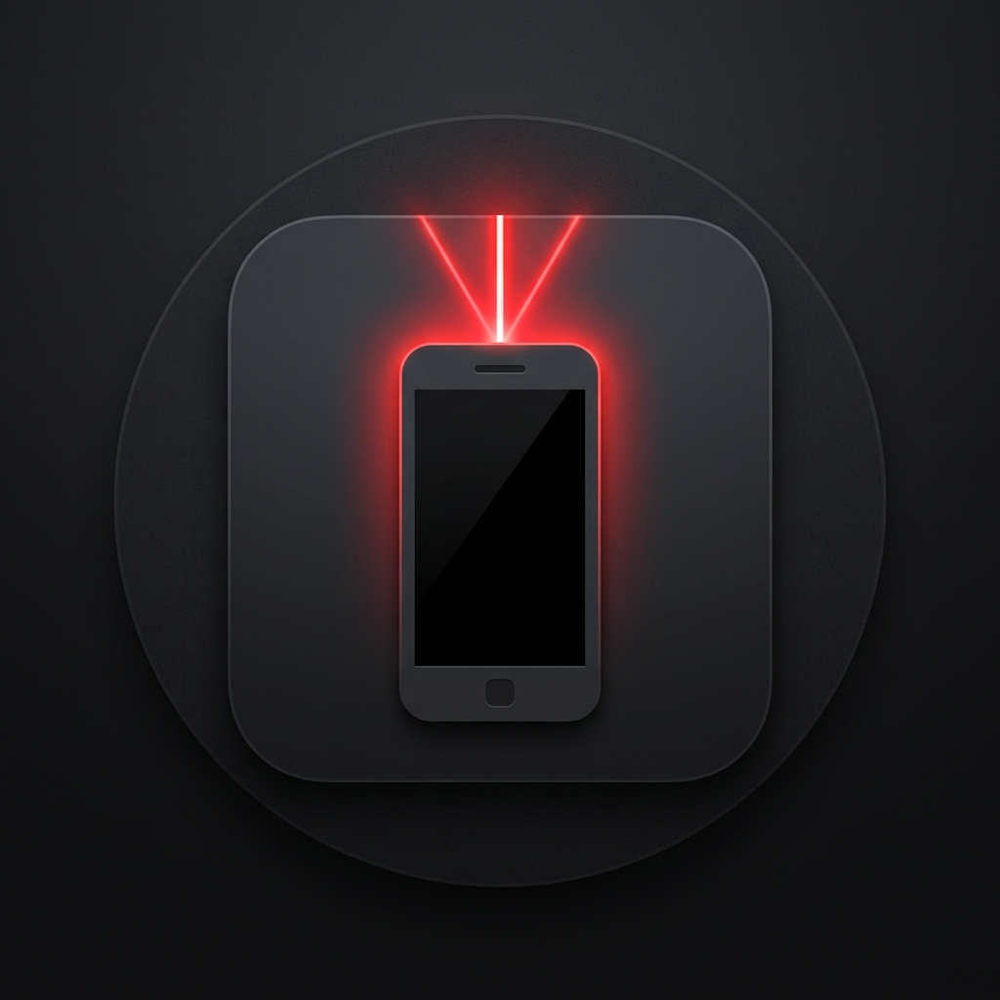

<div align="center">
  
  <h1>Phaser 🎯</h1>
  <p><b>Turn your smartphone into a magical presentation laser pointer and clicker!</b></p>
  
  [](https://github.com/Szarmander/Phaser---Phone-Laser/releases/latest)
  [](https://github.com/Szarmander/Phaser---Phone-Laser/releases/latest)
</div>

<br/>

Phaser is a lightweight, zero-configuration desktop application that seamlessly connects your smartphone to your computer. It allows you to use your phone's touchscreen or gyroscope as a laser pointer for your presentations, while also serving as a slide clicker. 

No mobile app installation required—just scan a QR code and present!

> 🍏 **Mac Users Note:** Since this is an indie app, macOS might say the app is "damaged" and should be moved to the Trash. To fix this, open your Terminal and run:
> `xattr -cr /Applications/Phaser.app` (Change the path if you didn't place it in Applications). Then you can open it normally!


## ✨ Features
- **Zero Mobile Setup:** Simply scan the QR code displayed on your Mac to instantly open the controller web-app.
- **Secure & Seamless:** Automatically generates a secure, lag-free Cloudflare Tunnel so your phone connects instantly without annoying security warnings or IP configurations.
- **Two Controller Modes:**
  - **Magic Wand (Gyroscope):** Point your phone at the screen and use it like an air mouse. Just tap "Recenter" to instantly calibrate!
  - **Virtual Touchpad:** Drag your finger across your phone screen for high-precision cursor control.
- **Presentation Clicker:** Built-in left and right buttons to smoothly transition your PowerPoint or Keynote slides.
- **Visual Overlays:**
  - 🔴 **Laser Mode:** A smooth, glowing red dot that floats above your full-screen presentation.
  - 🔦 **Highlight Mode:** Dims the screen and creates a spotlight effect around your pointer to focus the audience's attention.
- **Multi-Monitor Support:** Automatically detects your displays and lets you choose which monitor to present on.

## 🛠 Tech Stack
- **Desktop App:** [Electron.js](https://www.electronjs.org/) for a frameless, transparent overlay that floats above native macOS full-screen spaces.
- **Backend:** Node.js with [Express](https://expressjs.com/) and [Socket.io](https://socket.io/) for real-time, low-latency bi-directional communication.
- **Networking:** [Cloudflared](https://github.com/cloudflare/cloudflared) for generating instant, secure HTTPS tunnels to satisfy iOS Safari's strict gyroscope security requirements.
- **Frontend:** Vanilla HTML/CSS/JS (Lightweight and fast).

## 🚀 Installation & Requirements

### Requirements
- **macOS** (Currently utilizes AppleScript for global slide navigation).
- **Node.js** (v20+ recommended).
- **npm** (Node Package Manager).

### Setup
1. **Clone the repository:**
   ```bash
   git clone https://github.com/Szarmander/Phaser---Phone-Laser.git
   cd Phaser---Phone-Laser
   ```

2. **Install dependencies:**
   ```bash
   npm install
   ```

3. **Start the application:**
   ```bash
   npm start
   ```

## 📱 How to Use

1. Launch the app on your Mac using `npm start`.
2. A window will appear showing "Establishing secure tunnel...". Wait a second or two for it to generate your private secure link.
3. Once the QR code appears, open your smartphone's camera and scan it.
4. Your phone's browser will open the Phaser Controller.
5. **Start Presenting!**
   - Tap the **Laser** or **Highlight** button to turn on the pointer.
   - Use the **Gyroscope** tab, point your phone at the center of your screen, and tap **Recenter** to use the magic wand!
   - Use the arrows at the bottom of your phone to change slides in Keynote, PowerPoint, or Google Slides.

## 🤝 Contributing
Feel free to open issues or submit pull requests. Currently, the slide-changing mechanism uses macOS AppleScript (`osascript`) to simulate keypresses. Contributions to add Windows/Linux support (e.g., using `robotjs` or similar libraries) are highly welcome!

## 📄 License
This project is open-source and available under the [MIT License](LICENSE).
